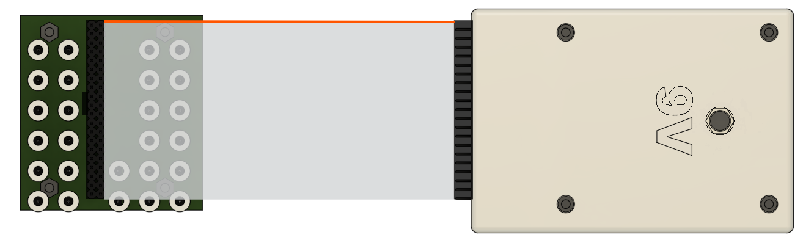
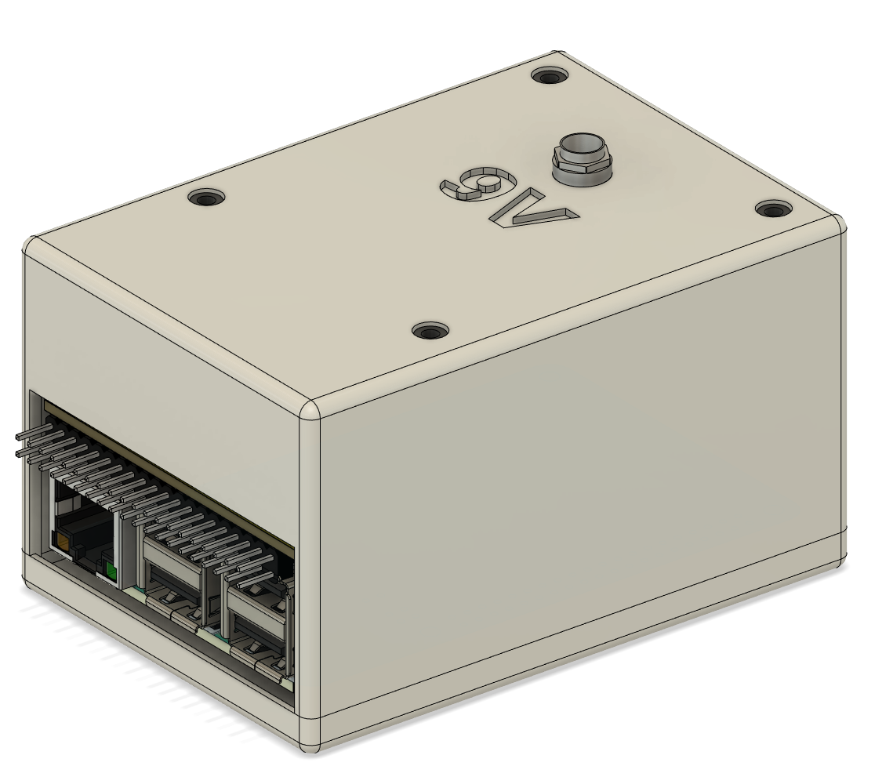
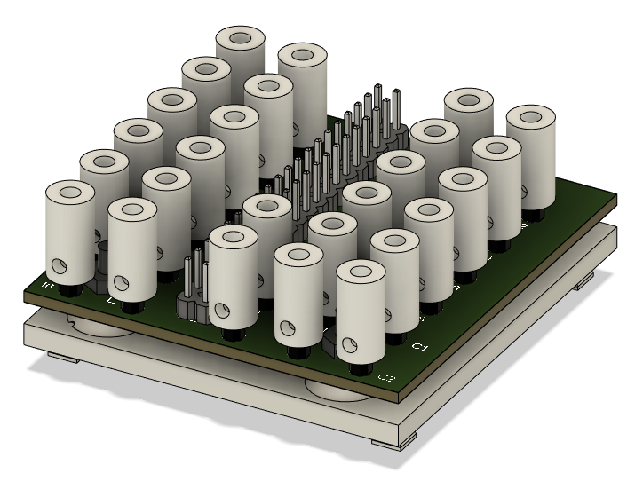

# fischer x pi - Hardware

This file includes the hardware assembly, setup and usage instructions.

# Setup after assembly

1. Connect the cables of the fischer technik sensors and motor so that they match the labeling on the `fischer_adaper` pcb (see `images/fischer_labels.png`)
2. Place the two components as shown in the picture below
3. Connect the 40 pin cable so that the red line remains on one side
4. Connect keyboard, mouse and display to the pi (alternatively vnc possible)
5. Connect the 9V power supply
6. Start software and have fun!

# Assembly pi_adapter

1. Solder all components except for the 40 pin connector (female) to the pcb
2. Assemble the lower part of the device up to the 20 mm spacers (see `images/pi_adapter/*.png`)
3. Plug the 40 pin socket onto the pi
4. Insert the `pi_adapter` pcb through the holes of the socket and place it on the spacers
5. Solder the 40 pin header to it
6. Add the 14 mm spacers
7. Solder cables to the 9v socket and screw the socket to the cover
8. Solder the cables to the board or plug them into the pin headers from below
9. Put the cover on the spacers and screw it tight
10. Check that it looks like the picture below
11. Compare with another one

# Assembly fischer_adapter

1. Screw 26 fischer sockets onto the individual pin headers
2. Solder the individual pin headers and the 40 pin header onto the `fischer_adapter` pcb
3. Screw the board onto the adapter backplate (see `images/fischer_adapter/*.png`)
4. Check that it looks like the picture below
15. Compare with another one

